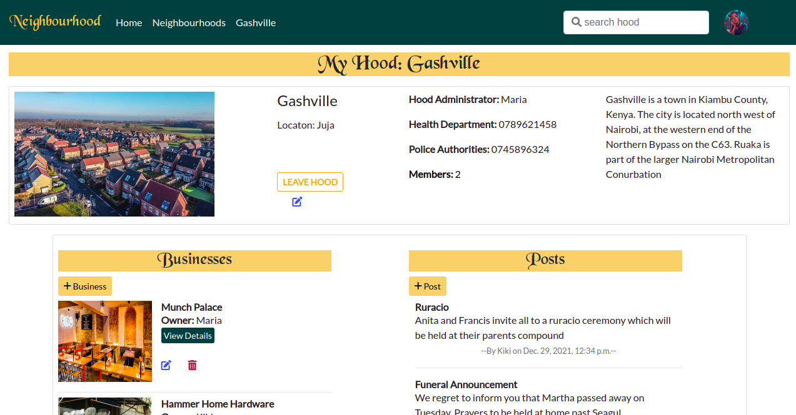

 # Neighbourhood
#### By Mary Njenga
## Table of Content
+ [Description](#description)
+ [Installation Requirement](#Installation)
+ [Behaviour Driven Development](#Behaviour-Driven-Development)
+ [Technology Used](#technology-used)
+ [Licence](#licence)
+ [Authors Info](#authors-info)

****
## Description
 Web application that allows you to be in the loop about everything happening in your neighborhood. From contact information of different handyman to meeting announcements or even alerts.

## Site image




## Live link
[View site](https://neighbourh00d.herokuapp.com/)
## Installation
### Requirements
* python3.6
* pip 

### Installation process
* Open terminal
* run ` git clone https://github.com/mary-wan/Neighbourhood.git`

### Dependancy Installation process
```
$ pip install -r requirements.txt

```

### Running the Application
To view the website run the command
```
$ python3.6 manage.py runserver


```
To run the tests run the command
```
$ python3.6 manage.py test neighbour

```
## Behaviour Driven Development
| Behaviour | Input | Output |
| :---------------- | :---------------: | ------------------: |
|  Form validation    | User submits empty or invalid data on form | An error is message is displayed    |
|  Valid form  | NUser enters input for fields and submits    | Neighbourhoods are displayed|

****

[Go Back to the top](#Neighbourhood)
## Technology Used
* Python- Django
* Html
* css

****
[Go Back to the top](#Neighbourhood)
## Licence
MIT License

Copyright (c) 2021 Mary Njenga

Permission is hereby granted, free of charge, to any person obtaining a copy
of this software and associated documentation files (the "Software"), to deal
in the Software without restriction, including without limitation the rights
to use, copy, modify, merge, publish, distribute, sublicense, and/or sell
copies of the Software, and to permit persons to whom the Software is
furnished to do so, subject to the following conditions:

The above copyright notice and this permission notice shall be included in all
copies or substantial portions of the Software.

THE SOFTWARE IS PROVIDED "AS IS", WITHOUT WARRANTY OF ANY KIND, EXPRESS OR
IMPLIED, INCLUDING BUT NOT LIMITED TO THE WARRANTIES OF MERCHANTABILITY,
FITNESS FOR A PARTICULAR PURPOSE AND NONINFRINGEMENT. IN NO EVENT SHALL THE
AUTHORS OR COPYRIGHT HOLDERS BE LIABLE FOR ANY CLAIM, DAMAGES OR OTHER
LIABILITY, WHETHER IN AN ACTION OF CONTRACT, TORT OR OTHERWISE, ARISING FROM,
OUT OF OR IN CONNECTION WITH THE SOFTWARE OR THE USE OR OTHER DEALINGS IN THE
SOFTWARE.


****
[Go Back to the top](#Neighbourhood)
## Authors Info
* Slack Profile - [Mary Njenga](https://app.slack.com/client/T077KKCG6/GLRQR61NW/user_profile/U027VKL1WLT?cdn_fallback=1)
* Email - [Mary Njenga](mary.njenga@student.moringaschool.com)

[Go Back to the top](#Neighbourhood)
